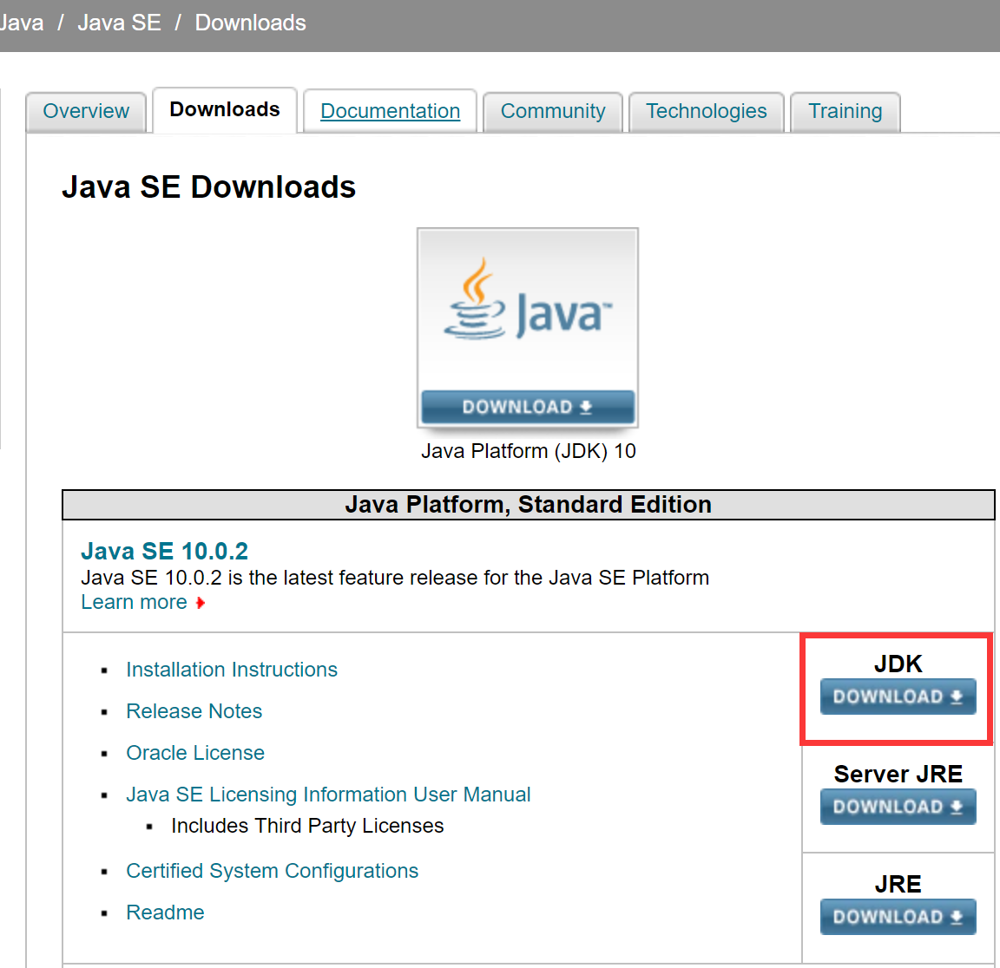
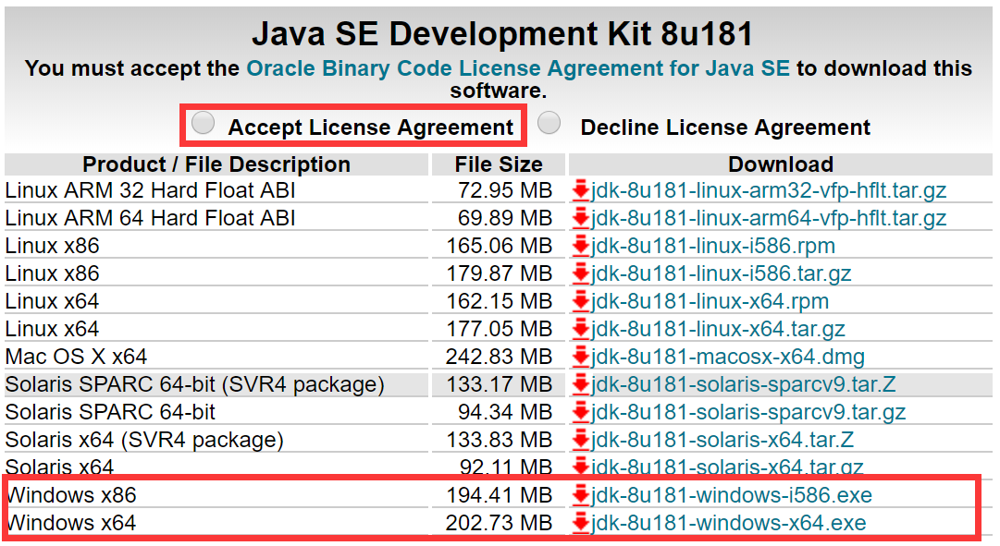
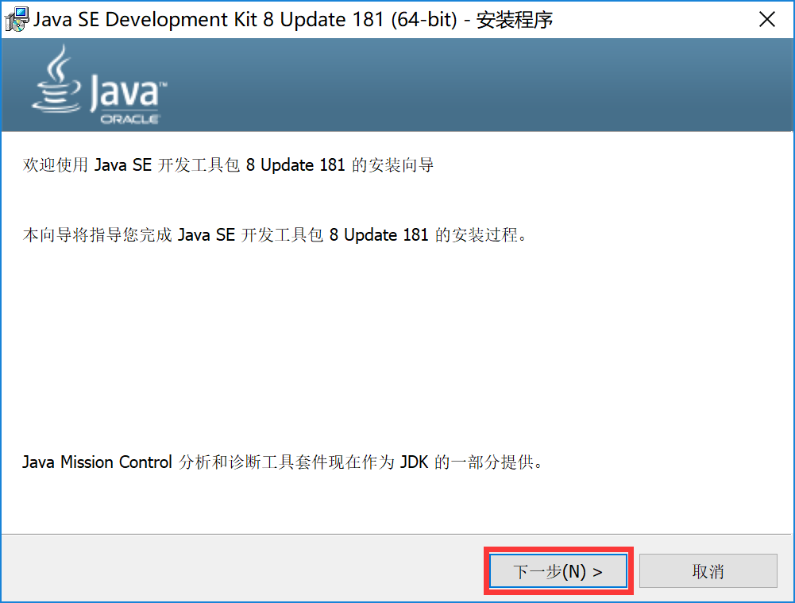
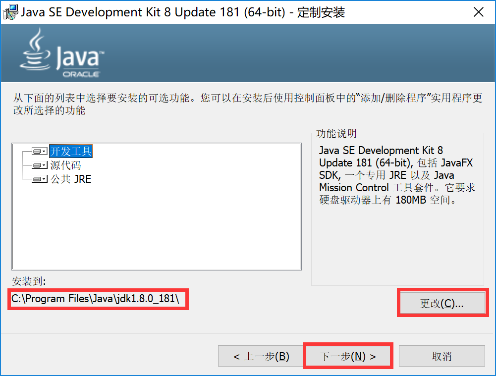
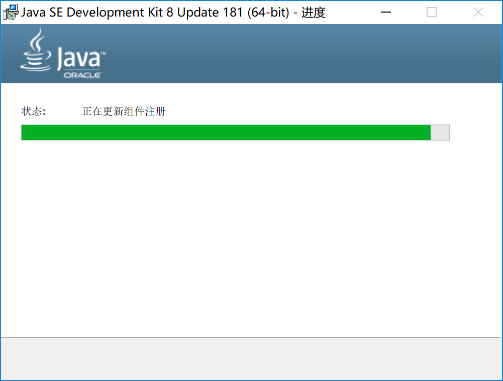
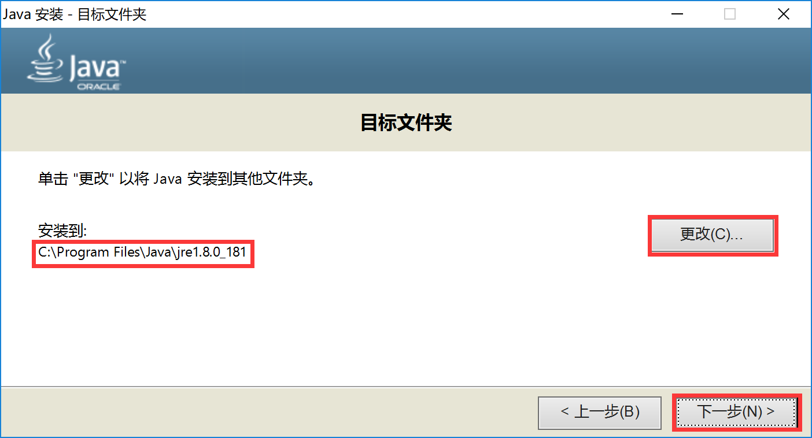
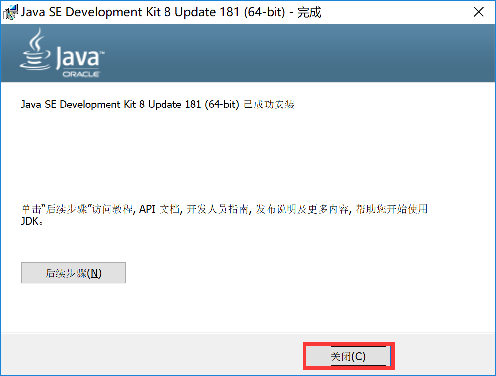
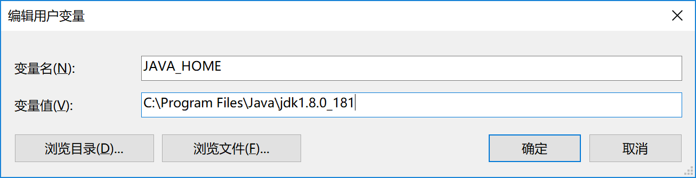
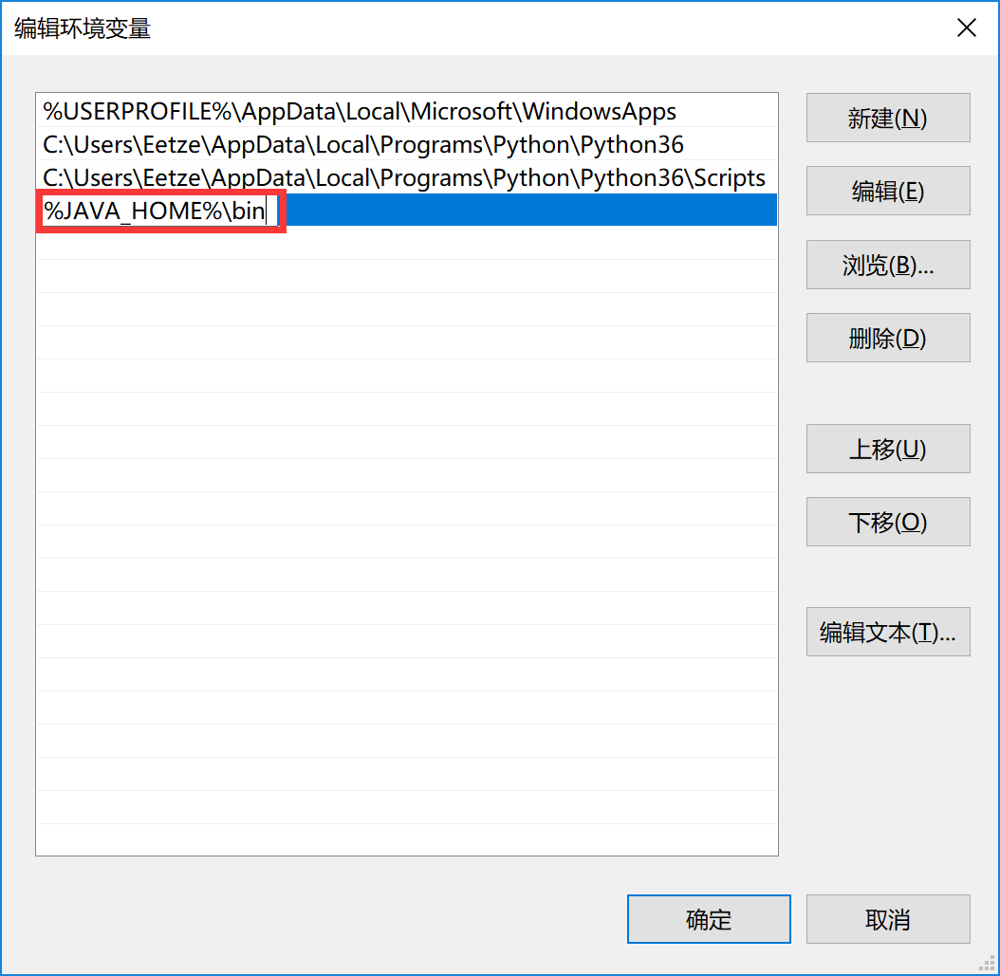
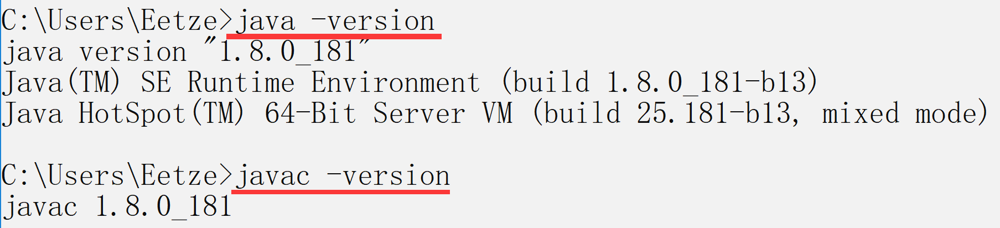

 

# JDK安装教程

#### 1. 登录Java官方下载网站（[http://www.oracle.com/technetwork/java/javase/downloads/index.html](http://www.oracle.com/technetwork/java/javase/downloads/index.html)），点击`JDK DOWNLOAD`按钮选择JDK下载。

 

#### 2. 选中`Accept License Agreement`单选框，并在下面列表中根据电脑系统情况，选择相应JDK进行下载。

 

#### 3. 下载完成后，会得到如下JDK安装文件，双击打开进行安装。

 

#### 4. 在如下安装界面，直接点击`下一步`按钮。

 

#### 5. 在如下定制安装界面，点击`更改`按钮选择JDK将要安装的位置，如不更改则会安装到默认位置（C:\Program Files\Java\jdk1.8.0_181\），然后点击`下一步`按钮。

 

#### 6. 等待JDK安装，安装过程中会弹出协议变更窗口，点击`确定`即可。

 

 

#### 7. 在弹出JRE安装界面时，点击`更改`选择JRE安装目录（建议与JDK放在同一目录下），然后点击`下一步`按钮，并等待JRE安装完成。

 

 

#### 8. 安装完成后会出现如下界面，此时JDK及JRE均已安装完成，点击`关闭`按钮关闭安装程序。

 

#### 9. JDK安装完成后需要配置环境变量，首先右键`此电脑（我的电脑）`选择属性，然后点击`高级系统设置`，在弹出的系统属性窗口中点击`环境变量`按钮。

 

#### 10. 在环境变量窗口，在`用户变量`或`系统变量`下进行环境变量的新建和编辑操作（用户变量只对系统当前登录用户起作用，系统变量则对系统下所有用户起作用）。

 

#### 11. 首先点击`新建`按钮，添加`JAVA_HOME`环境变量，变量名为`JAVA_HOME`，变量值为`C:\Program Files\Java\jdk1.8.0_181`（JDK安装目录路径，根据JDK安装情况填写）。

 

#### 12. 接下来选中`Path`环境变量，点击`编辑`按钮，然后在弹出列表中`新建`一条环境信息`%JAVA_HOME%\bin`。

 

#### 11. 点击`新建`按钮，添加`Classpath`环境变量，变量名为`Classpath`，变量值为`%JAVA_HOME%\lib\dt.jar;%JAVA_HOME%\lib\tools.jar`。

 

#### 12. 环境变量配置完成之后，打开命令行工具（cmd.exe），输入`java -version`和`javac -version`，如果显示如下信息，则说明JDK安装成功，并且环境变量配置完成。

 