 

# Android Studio使用真机调试

#### 1. 准备一部Android系统的手机，并使用USB数据线将手机与电脑连接，如连接时询问是否建立文件传输连接，选择`是，访问数据`（不同手机提示可能不相同，可在屏幕下滑菜单中对USB连接进行设置）。

 

#### 2. 在手机的设置中，找到`关于本机`菜单，然后连续点击`版本号`选项，直到下方提示` 您已处于开发者模式`，此时开发者模式已经打开，返回`设置`可找到`开发者选项`菜单。

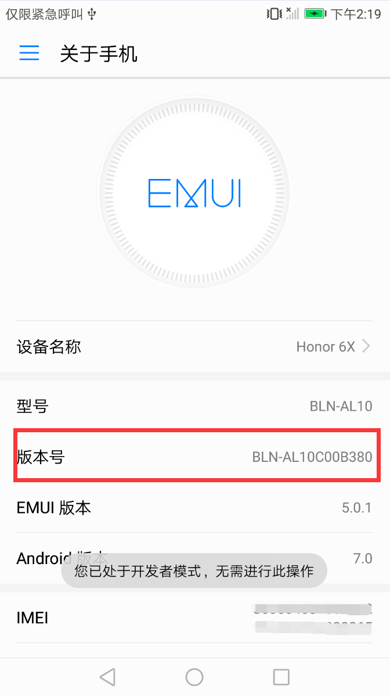 

#### 3. 打开`开发者选项`菜单，确保`开发者选项`与`USB调试`两项均为打开状态。

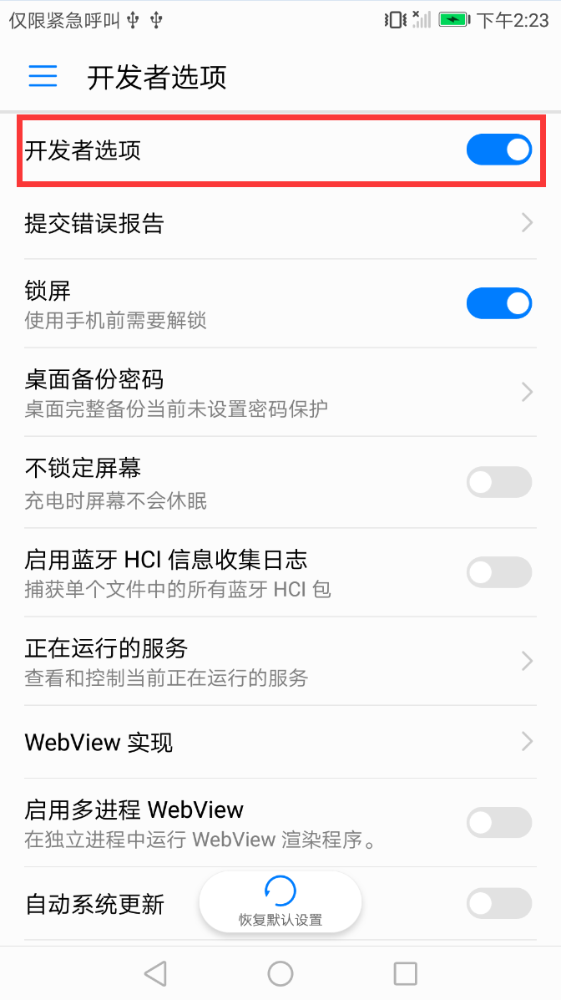 
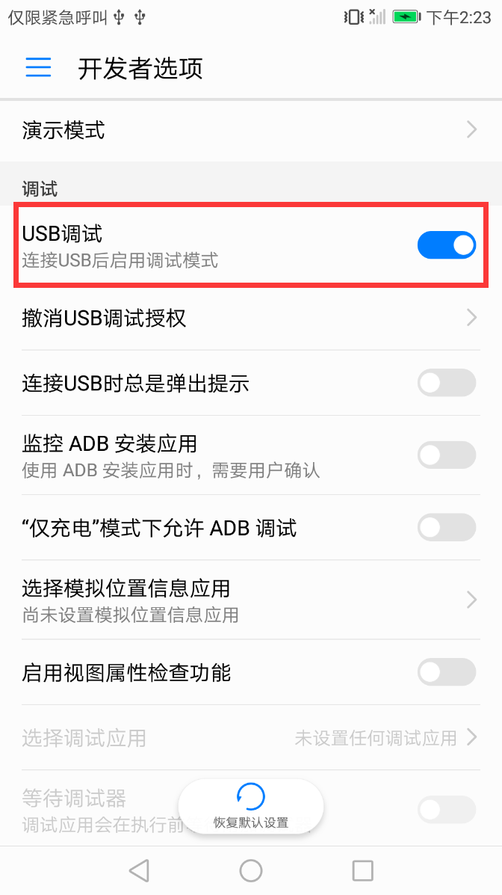 

#### 4. 在Android Studio中点击项目运行按钮。

 

#### 5. 在弹出的`Select Deployment Target`窗口中，查看是否能够找到真机设备，如果能够找到点击`OK`按钮并跳转到步骤12，没有找到真机设备则继续进行下步操作。

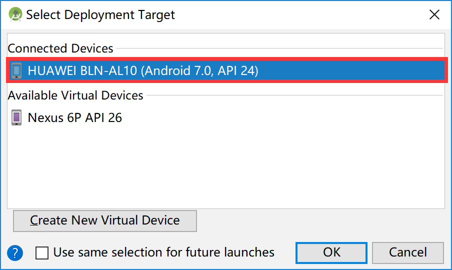 

#### 6. 没有找到真机设备的原因是电脑并没有安装真机设备的USB驱动，打开Android SDK Manager。

 

#### 7. 在Android SDK Manager中，选择`SDK Tools`标签，在下面列表中勾选`Google USB Driver`，并点击`Apply`进行安装。

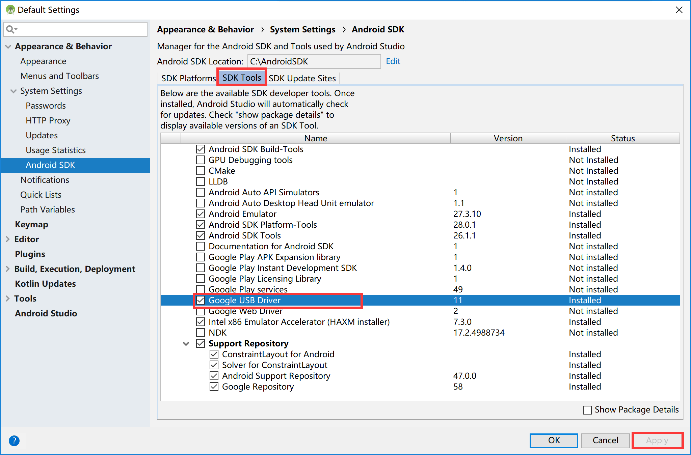 

#### 8. 安装完成之后，打开电脑的设备管理器，在设备管理器列表中的`便携设备`栏找到手机设备，并点击鼠标右键，在右键菜单中选择`更新驱动程序`选项。

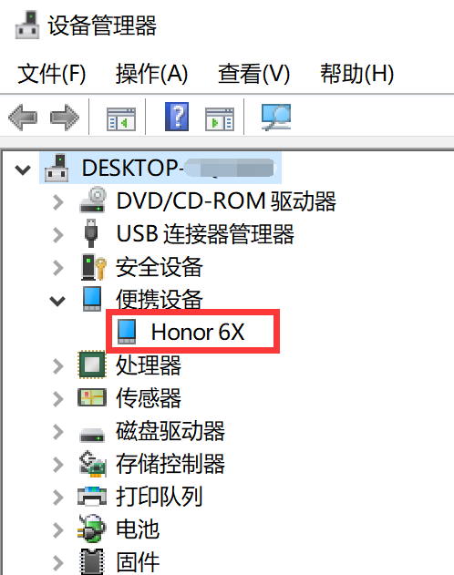 

#### 9. 在弹出的`如何搜索驱动程序`窗口中，选择`浏览我的计算机以查找驱动程序软件`。

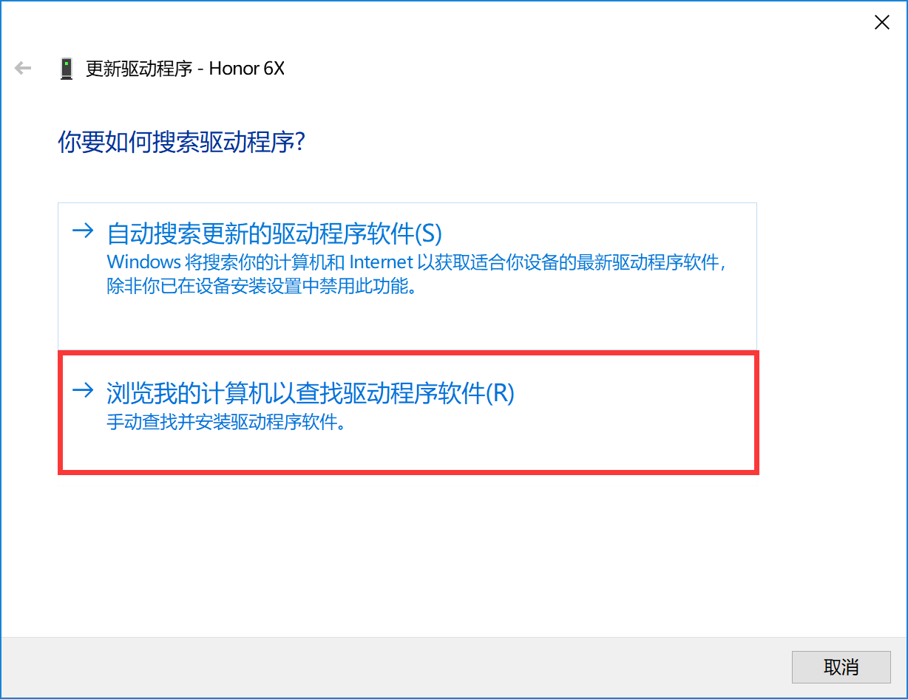 

#### 10. 在`浏览计算机上的驱动程序`窗口中，选择`Android SDK目录\extras\google\usb_driver`文件夹，并点击下一步。

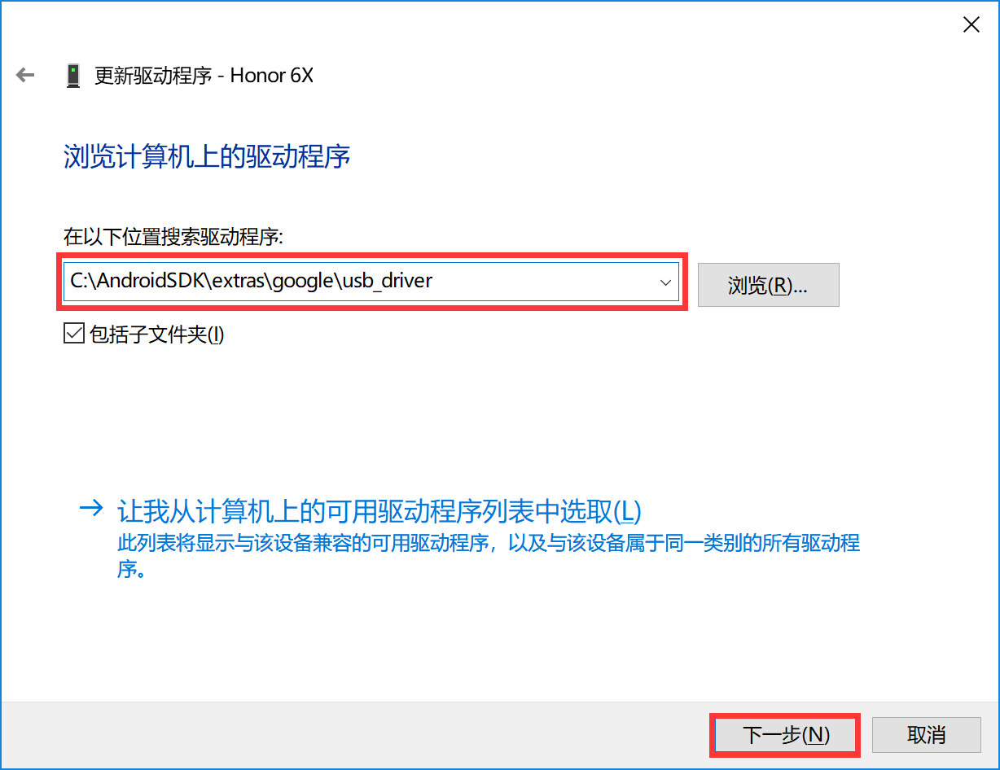 

#### 11. 弹出`你的设备的最新驱动程序已安装`菜单中，直接点击`关闭`按钮，此时再次点击Android Studio的项目运行按钮时，便可发现真机设备了。

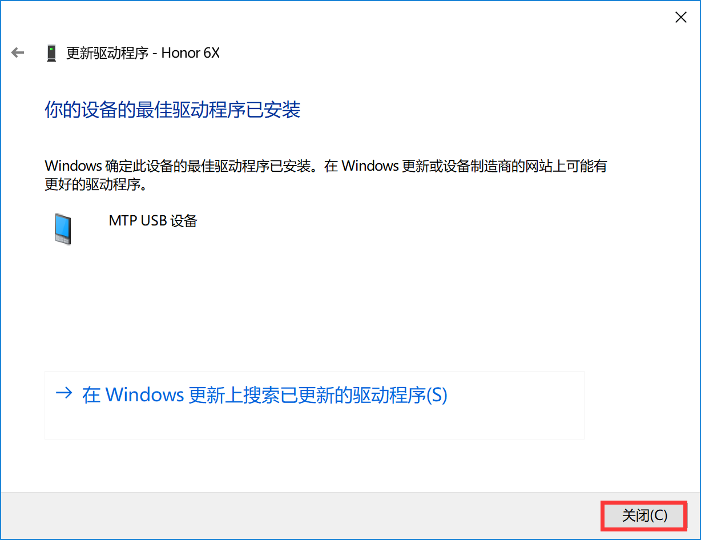 

#### 12. 运行时，可能会出现真机设备的Android API版本开发包在Android SDK中未下载的情况，此时会提示如下窗口，点击`Install and Continue`进行安装。

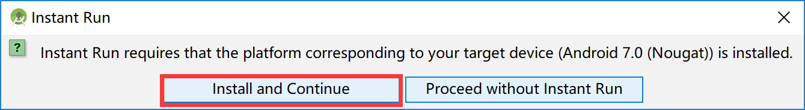 

#### 13. 等待下载完成，点击`Finish`按钮关闭窗口，并等待项目编译打包完成即可。

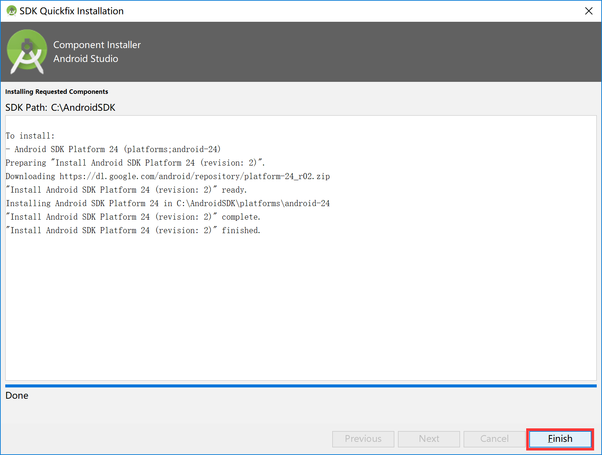 

#### 14. 部分Android机型在进行真机调试时，安装项目时会进行询问，选择安装即可。