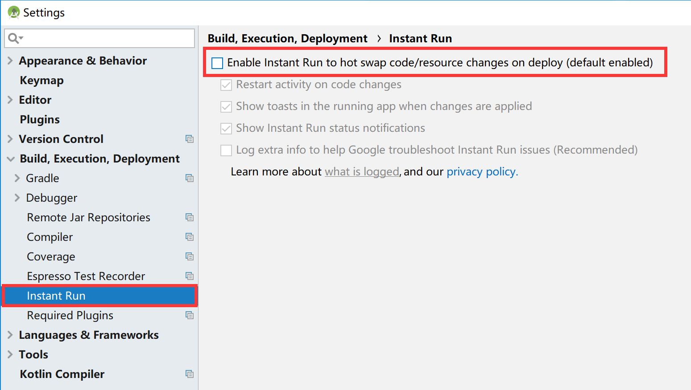

#### 问题：Android项目打包遇 com.android.builder.internal.aapt.v2.Aapt2Exception: AAPT2 error: check logs for details

项目在打包时遇到如下图错误：

 


#### 解决方法1：

本问题产生的原因主要是因为当前操作系统的用户名中有中文字符存在，更换一个英文用户名登录操作系统再次打包即可。


#### 解决方法2：

可在项目的`gradle.properties`文件的末尾添加下面配置。

```
android.enableAapt2=false
```

并在Android Studio的`Settings`中的`Instant Run`选项中，如图取消勾选，然后再次打包即可。

 

